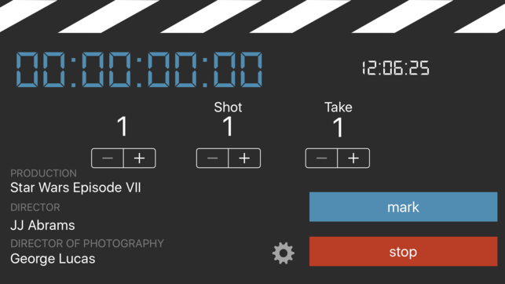
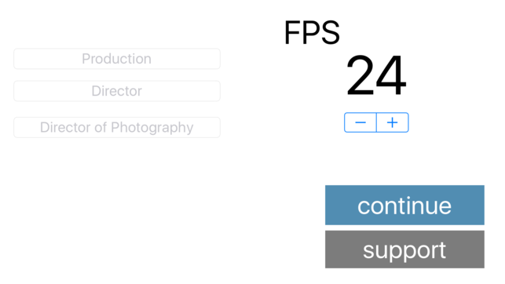

## Mark app - Available in the App Store, and alpha available in Play store.

Made in native for ios by [John Cotton](https://github.com/thejohncotton/) for the purpose of having a lightweight simple application for syncing audio and video in production.

- Download Mark in the [App Store](https://itunes.apple.com/us/app/mark-slate/id1189204279?mt=8)

- Download Mark (ALPHA) on [Google Play](https://play.google.com/store/apps/details?id=com.cotton.john.mark)

### Screen Shots

### Support/Contact

Having trouble with MarkSlate? Feel free to open up a [support ticket](https://github.com/thejohncotton/markApp/issues) on the github repo.
